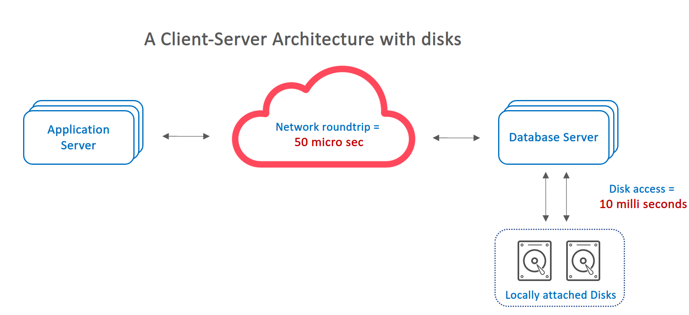
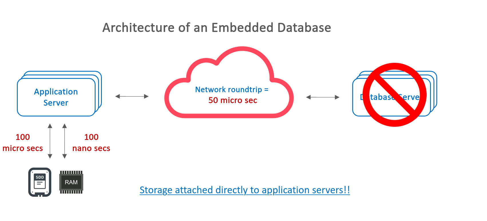

# rocksdb-workshop

[Chinses version](README_zh-tw.md)

This is a self-packed workshop for learning rocksdb.

</img>

## RocksDB: A Persistent Key-Value Store for Flash and RAM Storage

RocksDB is developed and maintained by Facebook Database Engineering Team.
It is built on earlier work on [LevelDB](https://github.com/google/leveldb) by Sanjay Ghemawat (sanjay@google.com)
and Jeff Dean (jeff@google.com)

RocksDB is a library that forms the core building block for a fast
key-value server, especially suited for storing data on flash drives.

It has a Log-Structured-Merge-Database (LSM) design with flexible tradeoffs
between Write-Amplification-Factor (WAF), Read-Amplification-Factor (RAF)
and Space-Amplification-Factor (SAF). 

It has multi-threaded compactions,
making it especially suitable for storing multiple terabytes of data in a
single database.

> **Read amplification**
>
> Read-amp is the amount of work done per logical read operation. This can be defined for in-memory databases, persistent databases assuming no cache (worst-case behavior) and persistent databases assuming some cache (average-case behavior). The work done in-memory can be the number of key comparisons and traditional algorithm analysis can be used. The work done on-disk includes the number of bytes transferred and seeks (seeks matter on disks, not on NVM). The work done can also include the cost of decompressing data read from storage which is a function of the read block size and compression algorithm.

> **Write amplification**
> 
> Write-amp is the amount of work done per write operation. This can include the number of bytes written to storage and disk seeks per logical write operation. This can be split into in-memory and on-disk write-amp but I frequently ignore in-memory write-amp.

> **Space amplification**
> 
> Space-amp is the ratio of the size of the database to the size of the data in the database. Compression decreases space-amp. It is increased by fragmentation with a B-Tree and old versions of rows with an LSM. A low value for space-amp is more important with flash storage than disk because of the price per GB for storage capacity.

## The History of RocksDB

You can reference the blog: [The History of RocksDB ](http://rocksdb.blogspot.com/2013/11/the-history-of-rocksdb.html) to understand the orginial idea why Facebook developed RocksDB.

Below diagrams explain why move database from client-server-database architecture to application-embedded architecture design.

## [Quickstart](quickstart.md)

* Scaffold Springboot Project
* Setup Maven dependecy
* Construct KVRepository for simple key/value service
* Initialize RocksDB in SpringBoot
* Build a key/value REST API
* Invoke & Test

## [Lab1 - Basic operation](lab1.md)

* Opening a Database
* RocksDB Options
* Closing a Database
* Reads
* Writes
  * Atomic Updates
* Concurrency
* Iteration
  * Iterate all key/value
  * Iterate keys in the range
  * Iterate keys in reverse order
  * Iterate keys in the range (reverse order)

## [Lab2 - Snapshot](lab2.md)

* Create a Snapshot
* Attach ReadOptions to Snapshot
* Iterate via Snapshot

