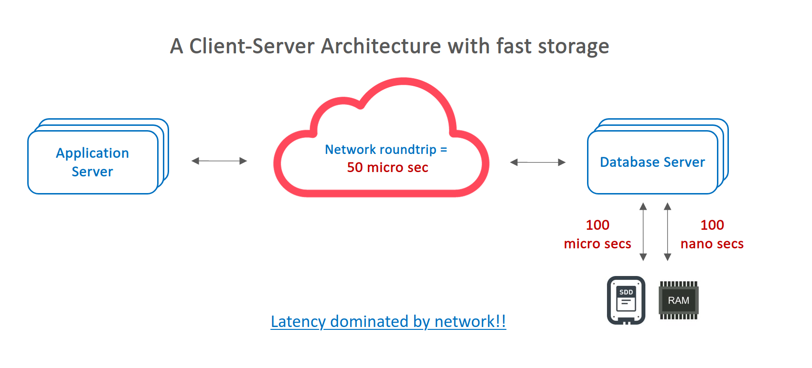

# rocksdb-workshop

[English version](README.md)

這是一個自主學習的workshop, 主要用於學習如何使用rocksdb。

</img>

## RocksDB: A Persistent Key-Value Store for Flash and RAM Storage

RocksDB是由Facebook數據庫工程團隊來進行開發和維護。
它是基於Sanjay Ghemawat (sanjay@google.com)和Jeff Dean (jeff@google.com)在[LevelDB]（https://github.com/google/leveldb）的基石上構建而成的。

RocksDB是一個函式庫，可用來構建高效key-value服務器的核心模組，它特別適合在flash drives的硬體上存儲數據。

它的底層是基於日誌結構合併數據庫（LSM）設計，並具有靈活設定來讓設計者在`寫放大因子（WAF）`和`讀放大因子（RAF）`和`空間放大因子（SAF）`中去進行權衡的調整。

它具有多線程壓縮，使其特別適合在單個數據庫中存儲多個TB的數據

> **Read amplification**
>
> Read-amp是每一次要完成`讀取資料操作`所需要的工作量。它可以用來定義或審視一個“內存數據庫”, “沒有緩存的持久性數據庫”和“有些許緩存的持久性數據庫”在進行讀取操作特性。

> **Write amplification**
> 
> Write-amp是每一次要完成`寫入資料操作`所需要的工作量。

> **Space amplification**
> 
> Space-amp是數據庫邏輯數據大小與數據庫中真實儲存數據大小之比率。壓縮會降低`空間放大因子（SAF）`。由於存儲容量每GB的價格，閃存的空間Space-amp相比使用磁盤來說更是重要。

## The History of RocksDB

你可以參考　[The History of RocksDB ](http://rocksdb.blogspot.com/2013/11/the-history-of-rocksdb.html) 來了解為什麼Facebook開發RocksDB的初始想法。

下面的三個圖示簡單說明了為什麼將數據庫從`client-server-database`架構遷移到`application-embedded`架構設計。

## [Quickstart](quickstart_zh-tw.md)

* 快速構建 Springboot Project
* 設定 Maven 依賴關係
* 構建一個簡單的key/value數據存儲服務
* 在進行讀取操作特性RocksDB
* 構建key/value操作的REST API
* 調用與測試

## [Lab1 - Basic operation#1](lab1.md)

* 打開一個數據庫
* RocksDB設定項
* 關閉一個數據庫
* 讀取鍵值對
* 寫入鍵值對
  * 原子性更新
* 並發原則
* 迭代器
  * 迭代所有鍵值對
  * 迭代特定鍵值範圍的鍵值對
  * 逆序迭代所有鍵值對
  * 逆序迭代特定鍵值範圍的鍵值對

