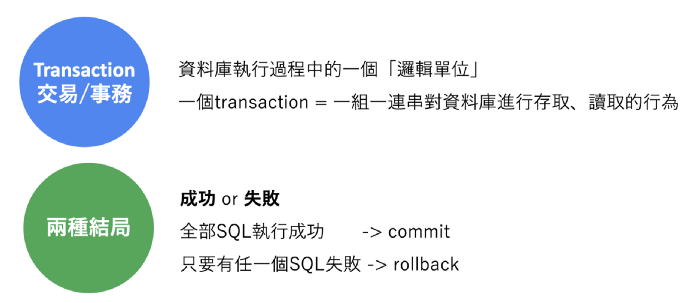
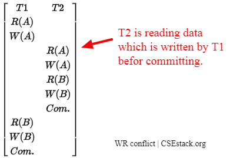
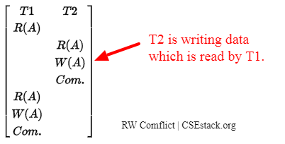
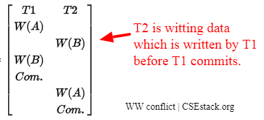
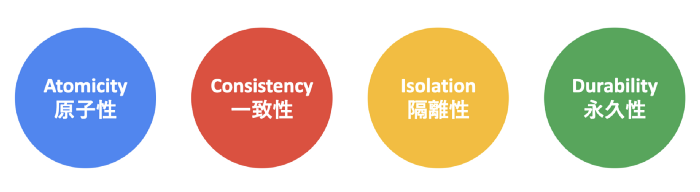
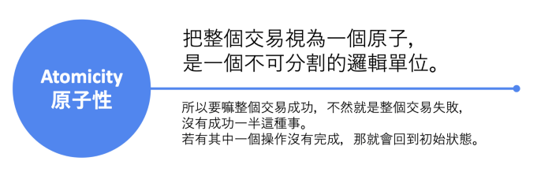
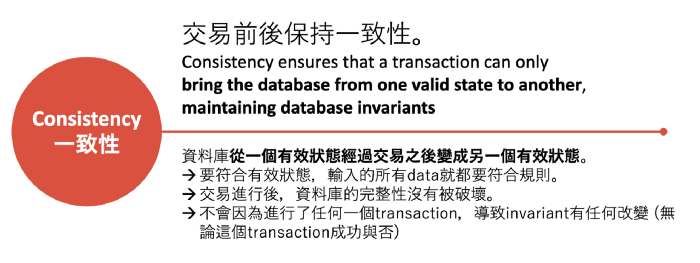
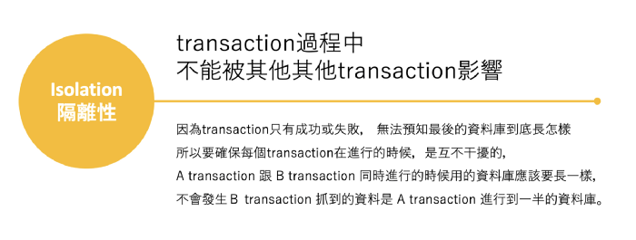
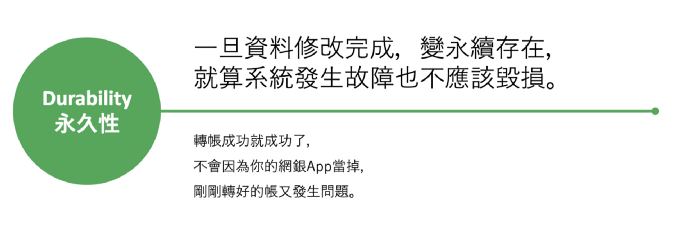

# 資料庫併發控制原理

資料庫訪問是通過事務完成的，首先我們搞清楚什麼是事務？

* 被視為整體的一組工作
* 這組工作要麼完全完成，要麼全部不完成，不存在部分完成情況

真實生活中以轉帳說明事務：

* 第一步，從帳戶A中減去X元金額；
* 第二步，將X元金額存入帳戶B

這些多步操作必須全部完整完成，不能半途而廢。資料庫事務的工作方式與此相同。他們能保證，無論發生什麼事情，數據的操作處理都被看成是`原子的(atomic)`（你永遠不會看到「轉變一半」的情況）。



## 在併發訪問資料庫的情況下會發生什麼問題

並發流程可能會改變**隔離性**和**一致性**這兩個屬性。讓我們假設兩個用戶預訂了一架飛機的同一個座位:

* 客戶1 發現一個空座位
* 客戶2 發現同樣的空座位
* 客戶1預訂了這個座位
* 客戶2也同時預訂了這個座位

我們將事務的順序執行稱為**schedule調度**，它表示基於時間先後的一系列事務執行，在這裡客戶1和客戶2分別存在兩個事務，這個兩個事務同時發生，我們需要通過串行化serializability來保證事務正確執行，也就是說，需要通過一個調度來實現並發控制機制。

一個調度包含下面一些操作:

* read R(X)
* write W(X)
* commit (所有操作完成後，這些操作應該被確認和記錄)
* abort (在執行一部分操作後，如果我們退出，所有操作應該沒有一個被確認完成或記錄保存)

為了有完整的調度，commit 或abort是被強制的。

> serial schedule 串行調度是事務執行時間沒有交織，所有操作都是順序執行。

## 衝突操作

當下面條件滿足時，Conflicting operation衝突操作會出現:

* 它們屬於不同的事務
* 它們得訪問同一的對象X
* 至少其中一個操作是W(X) (對X的寫操作)

下面列出三種衝突:

* __寫讀衝突__ Write-Read Conflict : 讀到一個未提交uncommitted的數據
* __讀寫衝突__ Read-Write Conflict : 首次讀以後，再讀已經被修改的數據。
* __寫寫衝突__ Write-Write Conflict :其中一個寫操作丟失

### 寫讀衝突 Write-Read Conflict

Write-Read Conflict, 也稱為reading uncommitted data讀未提交的數據或髒都dirty-read，當一個事務T2試圖讀取資料庫對象A，但是其已經被事務T1修改，還沒有提交確認，當T1繼續其事務時，對象A的數據已經不一致了，如下圖：

```
A, B - two different data objects from database

T1, T2 - two different transactions

R(A) - reading data A

W(A) - Writing data A

Com. - committing transaction
```



換句話說，`髒讀`是當一個事務讀取了被另外一個事務修改但是還沒有提交確認的資料。

### 讀寫衝突 Read-Write Conflict

讀寫衝突 Read-Write Conflict, 也稱為unrepeatable reads, ，當一個事務T1讀兩次資料庫對象A，第一讀以後事務T1等待事務T2完成，T2覆蓋重寫了對象A，當T1再次讀A時，A數據存在兩個不同版本，T1被強迫退出，因為這是不可重複的讀。



真實案例：Bob和Alice是票務員，他們要預訂一個表演票，只剩餘一張了，Alice登錄進入，發現這票比較貴，猶豫了一下，而Bob登錄進入後，就立即買了這張票，然後退出。Alice決定買這張票時，發現已經沒有多餘的票了。

### 寫寫衝突 Write-Write Conflict

寫寫衝突 Write-Write Conflict, 也稱為覆蓋未提交數據overwriting uncommitted data，它是發生在當有一個丟失修改情況下，試圖使這種場景串行只能是下面兩者之一：要麼是事務T1版本，要麼是事務T2的版本：



一旦併發事務應用到資料庫上，使用調度確保串行化，也就是執行是順序的，不會有時間的重疊。

## Transaction 四大特性： ACID



transaction 所具備的四個特性：

* __A__ tomicity 原子性
* __C__ onsistency 一致性
* __I__ solation 隔離性
* __D__ urability 永久性

一般常拿每個特性的英文開頭字母簡稱為 「**ACID**」。









## 樂觀鎖 (Optimistic Locking) 與 悲觀鎖 (Pessimistic Locking)

有時候在 db 中會發現重複的值，在交易頻繁的網站更是如此，那就需要 lock。

### 樂觀鎖

* 每次去拿數據的時候，都認為別人不會修改數據，所以不會對數據上鎖，這樣在你拿數據的時候別人也能拿和你屬於同一條的數據。
* 在更新數據時，會判斷在這期間是否有人更新過數據，如果有，則本次更新失敗；否則成功。
* 由於多個用戶可以同時對同一條數據進行訪問，增加了數據庫的吞吐量。
* 適合在資源爭用不激烈的時候使用。

### 悲觀鎖

* 每次去拿數據的時候，都認為別人會修改數據，因此會對數據上鎖，這樣在自己讀寫數據的過程中，別人不能讀寫這條數據，只能等待本次處理結束，才能訪問。
* 嚴謹、有效的保證了數據的有效行
* 不能同時對數據庫中同一條數據進行訪問，大大減少了數據庫的吞吐量。
* 需要持續的與數據庫保持連接，因此不適合web應用
* 實現起來，比較麻煩。
* 在資源爭用比較嚴重的時候比較合適


## 參考

* [超詳細的資料庫系統並發控制原理](https://kknews.cc/zh-tw/news/jezkk8l.html)

* [Database Transaction & ACID - Kyle Mo](https://oldmo860617.medium.com/database-transaction-acid-156a3b75845e)

* [樂觀鎖 與 悲觀鎖 Optimistic Locking & Pessimistic Locking](https://mgleon08.github.io/blog/2017/11/01/optimistic-locking-and-pessimistic-locking/)

返回主目錄 >>  [README](README_zh-tw.md)