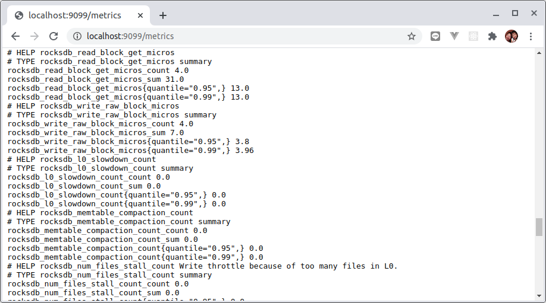
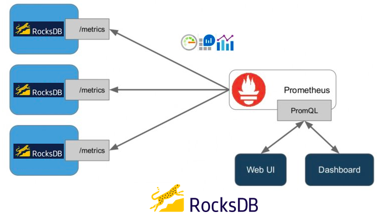
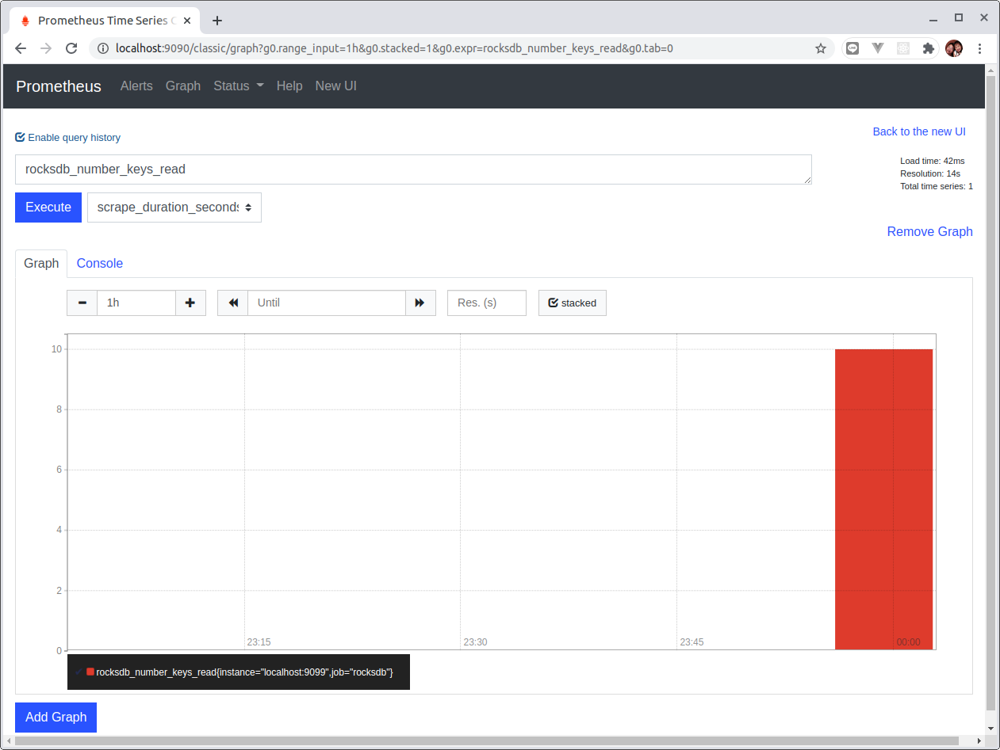

# Lab 7 - RocksDB Metrics

[Chinses version](lab7_zh-tw.md)

</img>

** [Example Source Code](lab7/) **

Software is becoming exponentially complex. To successfully delivery and run a product or service, we need "observability". 

## What is observability?

Observability is a term from control theory. In control theory, observability is a measure of how well internal states of a system can be inferred by knowledge of its external outputs. The observability and controllability of a system are mathematical duals.” - [Wikipedia: Observability](https://en.wikipedia.org/wiki/Observability)

In the world of software products and services, observability means you can answer questions about what’s happening on the inside of the system just by observing the outside of the system, without having to ship new code to answer new questions. 

Observability involves the combination of 3 pillars – Metrics, Logs, and Tracing – to give a much more in-depth view of what your application is doing. 

In this lab, we are going to export RocksDB `staticstics` information to allow integration with [Prometheus](https://prometheus.io/) using official [Prometheus Java client](https://github.com/prometheus/client_java).

## Custom Collector for RocksDB 

There two major types of metrics that `Statistics` provided:
* Ticker
* Histogram

Base on current Prometheus metrics types structure:
* Counter
* Gauge
* Histogram
* Summary

We are going to mapping RocksDB: `Ticker` to Prometheus:`Counter`, RocksDB:`Histogram` to Prometheus:`Summary`.

> Source: io.github.erhwenkuo.rocksdb.collector.StatisticInfoCollector

```java
/**
* Expose RocksDB statistics info to Prometheus metrics format.
*/
@Override
public List<MetricFamilySamples> collect() {
List<Collector.MetricFamilySamples> mfs = new ArrayList<>();

// convert 'Ticker' to Prometheus 'Counter'
for (TickerType tickerType : TickerType.values()) {
    if(tickerType != TickerType.TICKER_ENUM_MAX) {
        final String name = countersNameMap.get(tickerType);
        final String helpInfo = tickersHelpMap.get(tickerType);
        final double read = (double) stats.getTickerCount(tickerType);
        CounterMetricFamily counterMetricFamily = new CounterMetricFamily(name, helpInfo, read);
        mfs.add(counterMetricFamily);
    }
}

// convert 'Histogram' to Prometheus 'Summary'
for (HistogramType histogramType : HistogramType.values()) {
    if (histogramType != HistogramType.HISTOGRAM_ENUM_MAX) {
        final HistogramData histogramData = stats.getHistogramData(histogramType);
        final String name = histograms2NameMap.get(histogramType);
        final String helpInfo = histogramsHelpMap.get(histogramType);

        final double count = (double) histogramData.getCount();
        final double sum = (double) histogramData.getSum();
        final double p95 = histogramData.getPercentile95();
        final double p99 = histogramData.getPercentile99();
        // With labels. Record 95th percentile as p95, and 99th percentile as p99.
        SummaryMetricFamily labeledSummary = new SummaryMetricFamily(name, helpInfo,
                Collections.emptyList(), Arrays.asList(.95, .99));

        labeledSummary.addMetric(Collections.emptyList(), count, sum, Arrays.asList(p95, p99));

        mfs.add(labeledSummary);
    }
}
return mfs;
}
```

## Integrate RocksDB Custom Exporter

To allow Prometheus to scrape the RocksDB metrics, we need to expose these metrics via Http/Https. [Prometheus Java client](https://github.com/prometheus/client_java) includes a simple web server to simply the implementation.

```java
import io.github.erhwenkuo.rocksdb.collector.StatisticInfoCollector;
import io.prometheus.client.CollectorRegistry;
import io.prometheus.client.exporter.HTTPServer;
import org.rocksdb.Options;
import org.rocksdb.RocksDB;
import org.rocksdb.RocksDBException;
import org.rocksdb.Statistics;

import java.io.IOException;
import java.net.InetSocketAddress;

import static java.nio.charset.StandardCharsets.UTF_8;

public class RocksDBMetricsServer {
    static {
        RocksDB.loadLibrary();
    }

    public static void main(String[] args) throws IOException, RocksDBException {
        int port = 9099;
        InetSocketAddress socket = new InetSocketAddress(port);

        // RocksDB
        final Statistics statistics = new Statistics();
        final Options options = new Options();

        options.setCreateIfMissing(true);
        options.setStatistics(statistics);

        final RocksDB db = RocksDB.open(options, "/tmp/testdb");

        // Do some Put/Get operations
        final byte[] key = "some-key".getBytes(UTF_8);
        final byte[] value = "some-value".getBytes(UTF_8);

        db.put(key, value);
        for(int i = 0; i < 10; i++) {
            db.get(key);
        }

        // Customize Prometheus Exporter to expose RocksDB statistics metrics
        new StatisticInfoCollector(statistics).register();

        // A simple web server to expose RocksDB statistics metrics
        new HTTPServer(socket, CollectorRegistry.defaultRegistry);

        Runtime.getRuntime().addShutdownHook(new Thread(() -> {
            System.out.println("Application Terminating ...");
            System.out.println("Shutdown Hook is running !");
            // make sure you disposal necessary RocksDB objects
            db.close();
            options.close();
            statistics.close();
        }));
    }
}
```

You can run the program in IDE or using below command (if you have install MAVEN):

```sh
$ mvn exec:exec
```

The metrics will be accessed via: [http://localhost:9099/metrics](http://localhost:9099/metrics).




The integration architecture would look like below:



Configure `prometheus.yml`:

```yaml
global:
  scrape_interval:     15s 
  evaluation_interval: 15s

alerting:
  alertmanagers:
  - static_configs:
    - targets:
      # - alertmanager:9093

rule_files:
  # - "first_rules.yml"
  # - "second_rules.yml"

scrape_configs:
  - job_name: 'rocksdb'
    static_configs:
    - targets: ['localhost:9099']
```

Start your own Prometheus server and you should be able to see these RocksDB metrics in Promethues Web UI:



Back to main menu >>  [README](README.md)
