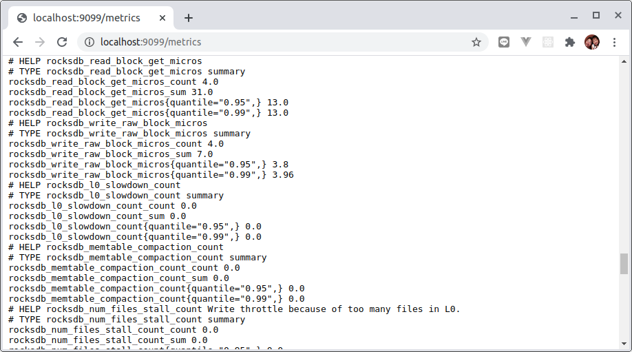
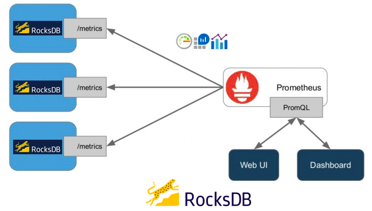
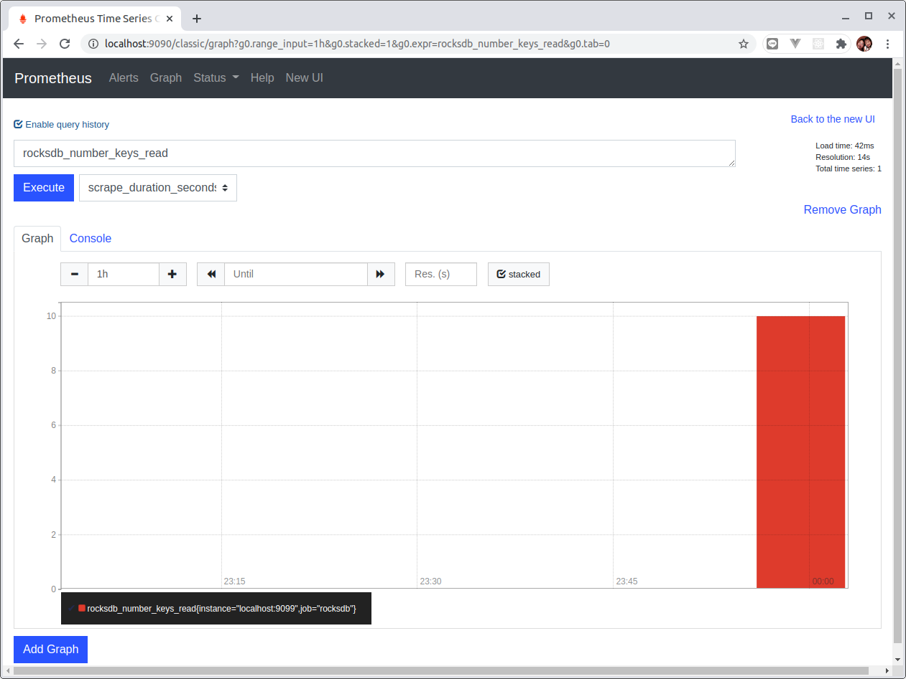

# Lab 7 - RocksDB Metrics

[English version](lab7.md)

</img>

** [Example Source Code](lab7/) **

應用程式軟體變得越來越複雜。為了成功交付並穩定運行產品或服務，我們需要“可觀察性”。

## What is observability?

可觀察性是控制理論中的一個術語。在控制理論中，可觀察性是通過了解系統的`外部輸出`可以很好地推斷系統`內部狀態`的一種`度量`。系統的可觀察性和可控制性是數學對偶(或者說是一種雙胞胎)。- [Wikipedia: Observability](https://en.wikipedia.org/wiki/Observability)

在軟體產品和服務的世界中，可觀察性意味著你只需要觀察系統外部就可以回答有關系統內部發生的問題，而不必交付新程式碼來回答新問題。

可觀察性涉及三個支柱的組合-`度量`，`日誌`和`追踪`。通過這三種數據可以更深入地了解你的應用程序在做什麼。

在本實驗中，我們將使用[Prometheus Java client](https://github.com/prometheus/client_java)來暴露出RocksDB`staticstics'訊息並與[Prometheus](https://prometheus.io/)整合。

## Custom Collector for RocksDB 

RocksDB `Statistics`提供了兩種主要類型的指標：
* Ticker
* Histogram

基於當前的Prometheus指標類型結構：
* Counter
* Gauge
* Histogram
* Summary

我們將把RocksDB: `Ticker`映射到Prometheus:`Counter`，將RocksDB:`Histogram` 映射到Prometheus:`Summary`。

> 程式碼: io.github.erhwenkuo.rocksdb.collector.StatisticInfoCollector

```java
/**
* Expose RocksDB statistics info to Prometheus metrics format.
*/
@Override
public List<MetricFamilySamples> collect() {
List<Collector.MetricFamilySamples> mfs = new ArrayList<>();

// convert 'Ticker' to Prometheus 'Counter'
for (TickerType tickerType : TickerType.values()) {
    if(tickerType != TickerType.TICKER_ENUM_MAX) {
        final String name = countersNameMap.get(tickerType);
        final String helpInfo = tickersHelpMap.get(tickerType);
        final double read = (double) stats.getTickerCount(tickerType);
        CounterMetricFamily counterMetricFamily = new CounterMetricFamily(name, helpInfo, read);
        mfs.add(counterMetricFamily);
    }
}

// convert 'Histogram' to Prometheus 'Summary'
for (HistogramType histogramType : HistogramType.values()) {
    if (histogramType != HistogramType.HISTOGRAM_ENUM_MAX) {
        final HistogramData histogramData = stats.getHistogramData(histogramType);
        final String name = histograms2NameMap.get(histogramType);
        final String helpInfo = histogramsHelpMap.get(histogramType);

        final double count = (double) histogramData.getCount();
        final double sum = (double) histogramData.getSum();
        final double p95 = histogramData.getPercentile95();
        final double p99 = histogramData.getPercentile99();
        // With labels. Record 95th percentile as p95, and 99th percentile as p99.
        SummaryMetricFamily labeledSummary = new SummaryMetricFamily(name, helpInfo,
                Collections.emptyList(), Arrays.asList(.95, .99));

        labeledSummary.addMetric(Collections.emptyList(), count, sum, Arrays.asList(p95, p99));

        mfs.add(labeledSummary);
    }
}
return mfs;
}
```

## Integrate RocksDB Custom Exporter

為了允許Prometheus抓取RocksDB指標，我們需要通過Http/Https公開這些指標。[Prometheus Java client](https://github.com/prometheus/client_java)包括一個簡單的Web服務器來簡化實現。

```java
import io.github.erhwenkuo.rocksdb.collector.StatisticInfoCollector;
import io.prometheus.client.CollectorRegistry;
import io.prometheus.client.exporter.HTTPServer;
import org.rocksdb.Options;
import org.rocksdb.RocksDB;
import org.rocksdb.RocksDBException;
import org.rocksdb.Statistics;

import java.io.IOException;
import java.net.InetSocketAddress;

import static java.nio.charset.StandardCharsets.UTF_8;

public class RocksDBMetricsServer {
    static {
        RocksDB.loadLibrary();
    }

    public static void main(String[] args) throws IOException, RocksDBException {
        int port = 9099;
        InetSocketAddress socket = new InetSocketAddress(port);

        // RocksDB
        final Statistics statistics = new Statistics();
        final Options options = new Options();

        options.setCreateIfMissing(true);
        options.setStatistics(statistics);

        final RocksDB db = RocksDB.open(options, "/tmp/testdb");

        // Do some Put/Get operations
        final byte[] key = "some-key".getBytes(UTF_8);
        final byte[] value = "some-value".getBytes(UTF_8);

        db.put(key, value);
        for(int i = 0; i < 10; i++) {
            db.get(key);
        }

        // Customize Prometheus Exporter to expose RocksDB statistics metrics
        new StatisticInfoCollector(statistics).register();

        // A simple web server to expose RocksDB statistics metrics
        new HTTPServer(socket, CollectorRegistry.defaultRegistry);

        Runtime.getRuntime().addShutdownHook(new Thread(() -> {
            System.out.println("Application Terminating ...");
            System.out.println("Shutdown Hook is running !");
            // make sure you disposal necessary RocksDB objects
            db.close();
            options.close();
            statistics.close();
        }));
    }
}
```

你可以在IDE中或使用以下命令運行該範例程式（如果有安裝MAVEN）：

```sh
$ mvn exec:exec
```

可以通過以下方式訪問指標：[http://localhost:9099/metrics](http://localhost:9099/metrics).




系統整合的架構如下所示：



要啟動Prometheus服務之前先修改 `prometheus.yml`:

```yaml
global:
  scrape_interval:     15s 
  evaluation_interval: 15s

alerting:
  alertmanagers:
  - static_configs:
    - targets:
      # - alertmanager:9093

rule_files:
  # - "first_rules.yml"
  # - "second_rules.yml"

scrape_configs:
  - job_name: 'rocksdb'
    static_configs:
    - targets: ['localhost:9099']
```

啟動你自己的Prometheus服務器，你應該能夠在Promethues Web UI中看到RocksDB指標：



返回主目錄 >>  [README](README_zh-tw.md)
