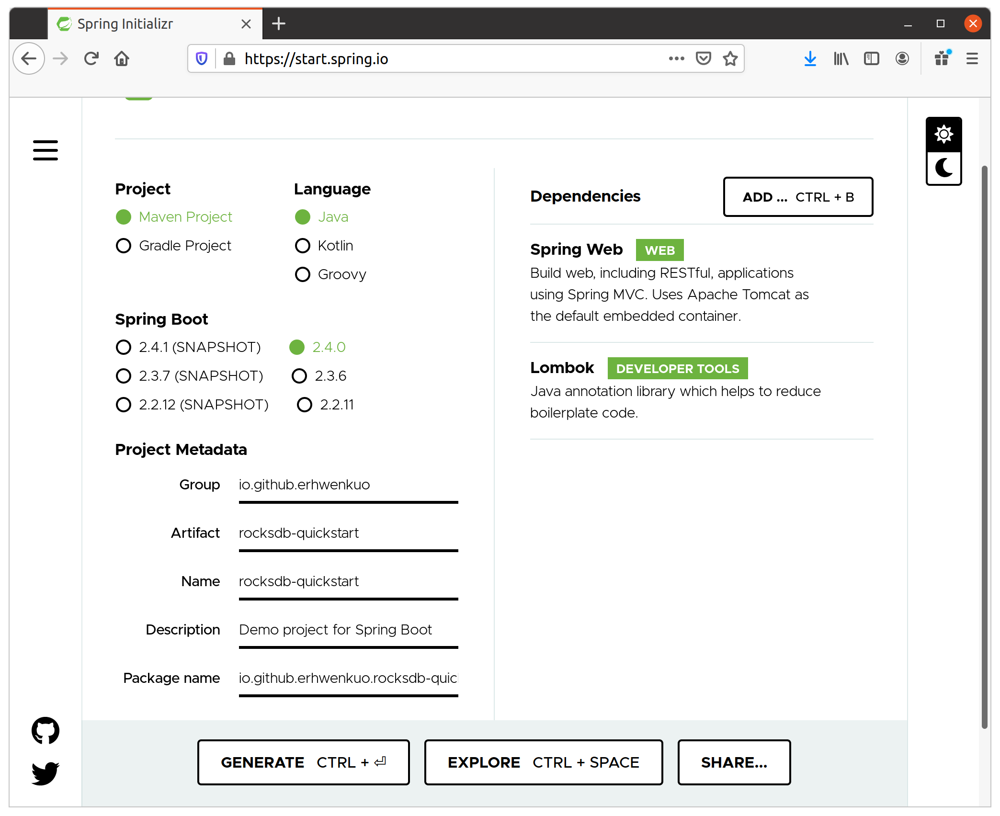
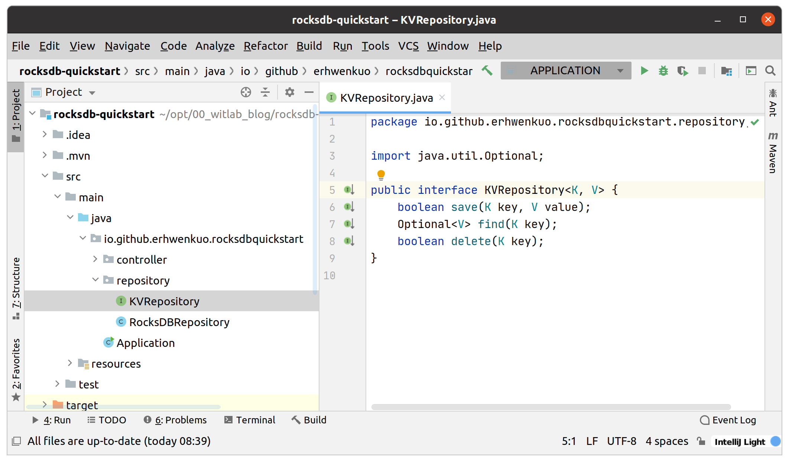
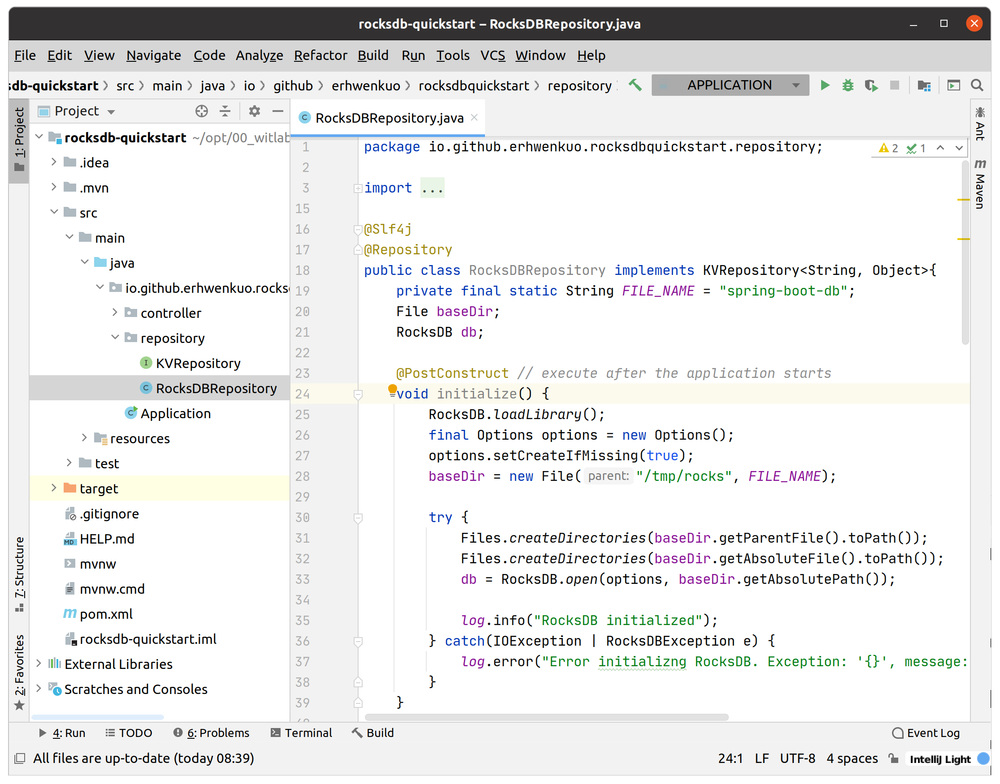
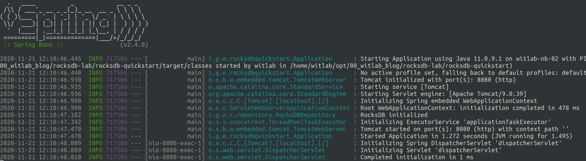

# Using RocksDB with Spring Boot and Java

[English version](quickstart.md)

</img>

[RocksDB](https://rocksdb.org/)是Facebook的嵌入式key-value存儲函式庫，它是Google [LevelDB](https://github.com/google/leveldb)的分支。它也被用作許多數據庫的存儲層，例如[CockroachDB](https://www.cockroachlabs.com/)。你可以將其用作嵌入式存儲資料庫，緩存庫或作為你自定義的數據庫，文件系統或存儲解決方案等的存儲層。

## Scaffold Springboot Project

你可以利用[spring initializr](https://start.spring.io/)來搭建一個新的Springboot項目。



點擊"GENERATE"按鈕並下載`rocksdb-quickstart.zip`。

專案檔案目錄結構如下:

```sh
rocksdb-quickstart
├── HELP.md
├── mvnw
├── mvnw.cmd
├── pom.xml
└── src
    ├── main
    │   ├── java
    │   │   └── io
    │   │       └── github
    │   │           └── erhwenkuo
    │   │               └── rocksdbquickstart
    │   │                   └── RocksdbQuickstartApplication.java
    │   └── resources
    │       ├── application.properties
    │       ├── static
    │       └── templates
    └── test
        └── java
            └── io
                └── github
                    └── erhwenkuo
                        └── rocksdbquickstart
                            └── RocksdbQuickstartApplicationTests.java
```

## Setup Maven dependecy

編輯`pom.xml`，添加以下依賴項以引入RocksDB:

```xml
<!-- https://mvnrepository.com/artifact/org.rocksdb/rocksdbjni -->
<dependency>
  <groupId>org.rocksdb</groupId>
  <artifactId>rocksdbjni</artifactId>
  <version>6.13.3</version>
</dependency>
```

作為參考，你可以查看範例的[pom.xml](rocksdb-quickstart/pom.xml)。

## Construct KVRepository for simple key/value service

我們想要構建一個存儲庫接口介面，通過該接口介面我們的應用程序可以與一般的存儲服務（尤其是RocksDB）進行交互。

在`repository`的package下創建一個接口介面`KVRepository.java`:

```java
import java.util.Optional;

public interface KVRepository<K, V> {
    boolean save(K key, V value);
    Optional<V> find(K key);
    boolean delete(K key);
}
```



保存，查找和刪除是我們從任何鍵值存儲中需要的基本操作動作，因此我們對此進行了定義。使用此界面，我們可以使用任何鍵值存儲而無需更改應用程序的其他部分，這是一個很好的設計。

## Initialize RocksDB in SpringBoot

接下來，我們創建RocksDB存儲庫作為該接口的實現。當應用程序在`initialize()`中啟動時，我們將初始化RocksDB數據庫。 RocksDB是一個low-level存儲函式庫，因此我們需要先將`鍵值對`序列化為字節，然後才能在`save()`，`find()`和`delete()`方法中進行運作。

創建一個類別`RocksDBRepository.java`:

```java
import lombok.extern.slf4j.Slf4j;
import org.rocksdb.Options;
import org.rocksdb.RocksDB;
import org.rocksdb.RocksDBException;
import org.springframework.stereotype.Repository;
import org.springframework.util.SerializationUtils;

import javax.annotation.PostConstruct;
import java.io.File;
import java.io.IOException;
import java.nio.file.Files;
import java.util.Optional;

@Slf4j
@Repository
public class RocksDBRepository implements KVRepository<String, Object>{
    private final static String FILE_NAME = "spring-boot-db";
    File baseDir;
    RocksDB db;

    @PostConstruct // execute after the application starts
    void initialize() {
        RocksDB.loadLibrary();
        final Options options = new Options();
        options.setCreateIfMissing(true);
        baseDir = new File("/tmp/rocks", FILE_NAME);

        try {
            Files.createDirectories(baseDir.getParentFile().toPath());
            Files.createDirectories(baseDir.getAbsoluteFile().toPath());
            db = RocksDB.open(options, baseDir.getAbsolutePath());

            log.info("RocksDB initialized");
        } catch(IOException | RocksDBException e) {
            log.error("Error initializng RocksDB. Exception: '{}', message: '{}'", e.getCause(), e.getMessage(), e);
        }
    }

    @Override
    public boolean save(String key, Object value) {
        log.info("saving value '{}' with key '{}'", value, key);

        try {
            db.put(key.getBytes(), SerializationUtils.serialize(value));
        } catch (RocksDBException e) {
            log.error("Error saving entry. Cause: '{}', message: '{}'", e.getCause(), e.getMessage());
        }

        return false;
    }

    @Override
    public Optional<Object> find(String key) {
        Object value = null;

        try {
            byte[] bytes = db.get(key.getBytes());
            if (bytes != null)
                value = SerializationUtils.deserialize(bytes);
        } catch (RocksDBException e) {
            log.error(
                    "Error retrieving the entry with key: {}, cause: {}, message: {}",
                    key,
                    e.getCause(),
                    e.getMessage()
            );
        }

        log.info("finding key '{}' returns '{}'", key, value);

        return value != null ? Optional.of(value) : Optional.empty();
    }

    @Override
    public boolean delete(String key) {
        log.info("deleting key '{}'", key);

        try {
            db.delete(key.getBytes());
        } catch (RocksDBException e) {
            log.error("Error deleting entry, cause: '{}', message: '{}'", e.getCause(), e.getMessage());

            return false;
        }

        return true;
    }
}
```



## Build a key/value REST API

在此階段，我們的存儲庫已完成，但不是很有用。讓我們添加一個控制器`KVController.java`，使我們能夠與存儲庫進行互動:

```java

import io.github.erhwenkuo.rocksdbquickstart.repository.KVRepository;
import lombok.extern.slf4j.Slf4j;
import org.springframework.http.HttpStatus;
import org.springframework.http.MediaType;
import org.springframework.http.ResponseEntity;
import org.springframework.web.bind.annotation.*;

@Slf4j
@RestController
@RequestMapping("/api")
public class KVController {
    private final KVRepository<String, Object> repository;

    public KVController(KVRepository<String, Object> repository) {
        this.repository = repository;
    }

    // curl -iv -X POST -H "Content-Type: application/json" -d '{"bar":"baz"}' http://localhost:8080/api/foo
    @PostMapping(value = "/{key}",
            consumes = MediaType.APPLICATION_JSON_VALUE,
            produces = MediaType.APPLICATION_JSON_VALUE)
    public ResponseEntity<Object> save(@PathVariable("key") String key, @RequestBody Object value) {
        return repository.save(key, value)
                ? ResponseEntity.ok(value)
                : ResponseEntity.status(HttpStatus.INTERNAL_SERVER_ERROR).build();
    }

    // curl -iv -X GET -H "Content-Type: application/json" http://localhost:8080/api/foo
    @GetMapping(value = "/{key}", produces = MediaType.APPLICATION_JSON_VALUE)
    public ResponseEntity<Object> find(@PathVariable("key") String key) {
        return ResponseEntity.of(repository.find(key));
    }

    // curl -iv -X DELETE -H "Content-Type: application/json" http://localhost:8080/api/foo
    @DeleteMapping(value = "/{key}", produces = MediaType.APPLICATION_JSON_VALUE)
    public ResponseEntity<Object> delete(@PathVariable("key") String key) {
        return repository.delete(key)
                ? ResponseEntity.noContent().build()
                : ResponseEntity.status(HttpStatus.INTERNAL_SERVER_ERROR).build();
    }
}
```


## Invoke & Test

We declare a simple REST controller that exposes save, find and delete endpoints. That's all there is to it.

我們構建了一個簡單的REST controller, 它公開了一組API來提供`save`，`find`和`delete`鍵值對的Http端點。

讓我們啟動應用程序。

```sh
$ mvnw spring-boot:run
```

該應用程序將開始偵聽端口:8000



* 創建一筆key/value資料

```sh
curl -X POST -H "Content-Type: application/json" -d '{"bar":"baz"}' http://localhost:8080/api/foo
```

* 來key來取回value

```sh
curl -X GET -H "Content-Type: application/json" http://localhost:8080/api/foo
```

* 移除key/value資料

```sh
curl -X DELETE -H "Content-Type: application/json" http://localhost:8080/api/foo
```

返回主目錄 >>  [README](README_zh-tw.md)